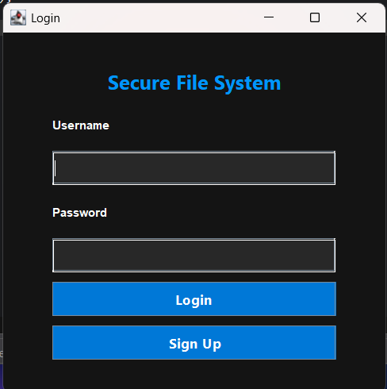
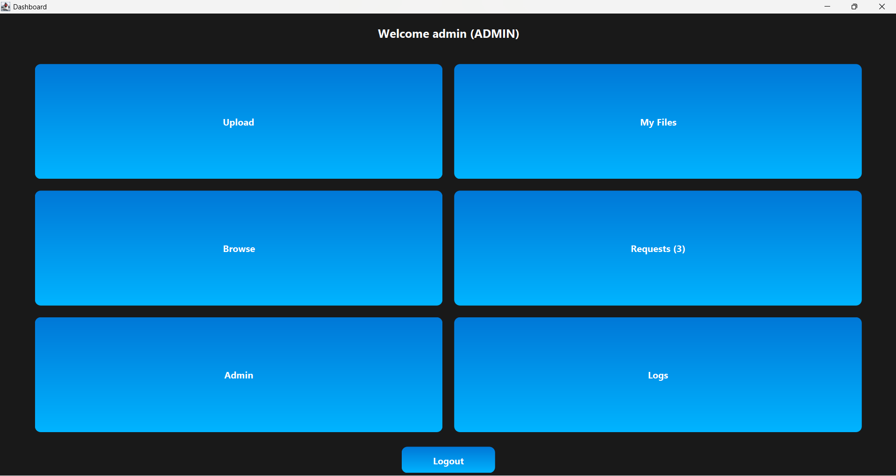
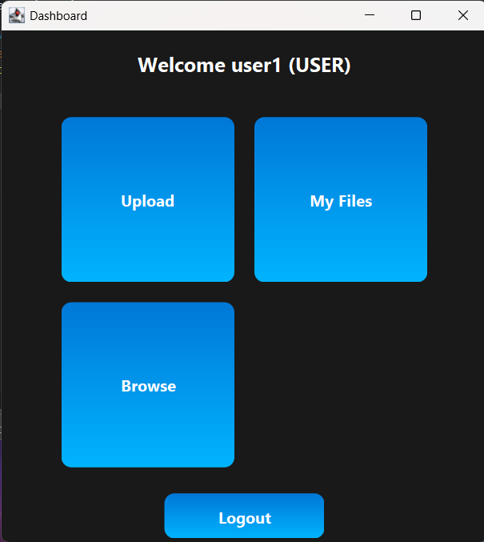

# Secure File Management System

## Team Members

* Mohamed Rayhaan Khan (192511006)
* Deepak R (192511008)
* Sanjana G (192511020)
* Giftson Kevin Matthew Y (192511167)
* Vijay Karthikeyan B (192511348)

## My Contributions (Deepak R)

I was responsible for the development and implementation of **Module 2 – File Upload & Storage Module**.

### Key Contributions

* Designed the secure file upload workflow.
* Implemented file upload functionality for authenticated users.
* Developed file storage management for secure document handling.
* Integrated uploaded files with the database for tracking and retrieval.
* Assisted in testing and validation of file storage operations.
* Participated in project documentation and system integration.

## Technologies Used

* Java
* Java Swing
* MySQL
* JDBC
* AES Encryption

## Features

* User Authentication
* Secure File Upload
* Encrypted File Storage
* File Download and Retrieval
* Admin Dashboard
* User Dashboard
* MySQL Database Integration

## Project Overview

Secure File Management System is a Java-based desktop application designed to provide secure file storage and management. The system supports user authentication, encrypted file handling, role-based access control, and database integration. Uploaded files can be securely stored, retrieved, and managed through dedicated user and administrator dashboards.

## Screenshots

### Login Page


### Admin Dashboard


### User Dashboard


## Database

The project uses MySQL for data storage.

Database script:

```sql
capstone.sql
```

Import the SQL file before running the application.

## How to Run

1. Install Java JDK 8 or above.
2. Install MySQL Server.
3. Create a database:

```sql
CREATE DATABASE capstone;
```

4. Import:

```text
capstone.sql
```

5. Configure database credentials in:

```text
src/main/java/util/DBConnection.java
```

6. Compile and run:

```bash
javac Main.java
java Main
```

## Project Structure

```text
src/main/java
│
├── dao
├── model
├── security
├── service
├── ui
├── util
└── Main.java
```

## Future Enhancements

* Cloud Storage Integration
* Multi-Factor Authentication
* File Sharing Between Users
* Audit Logging and Monitoring
* Advanced Encryption Management
